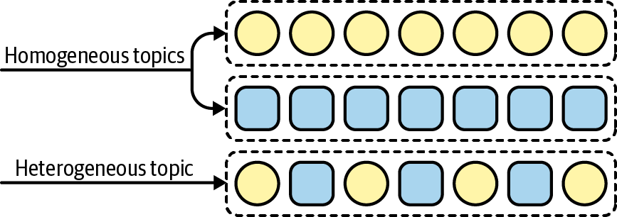
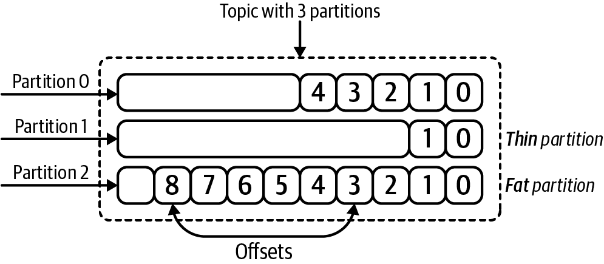
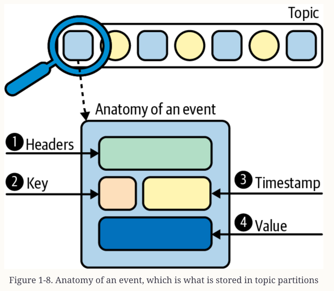
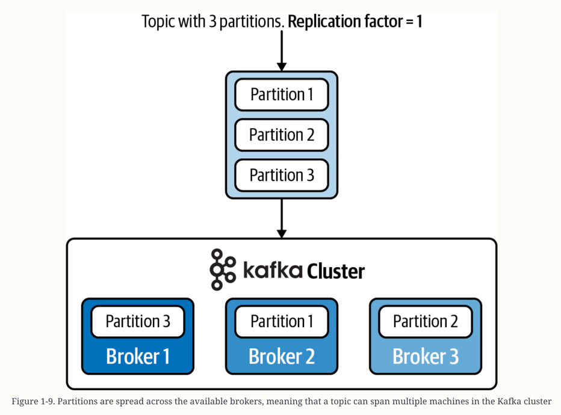
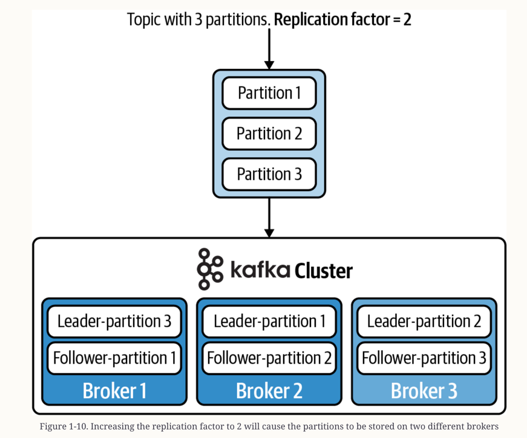
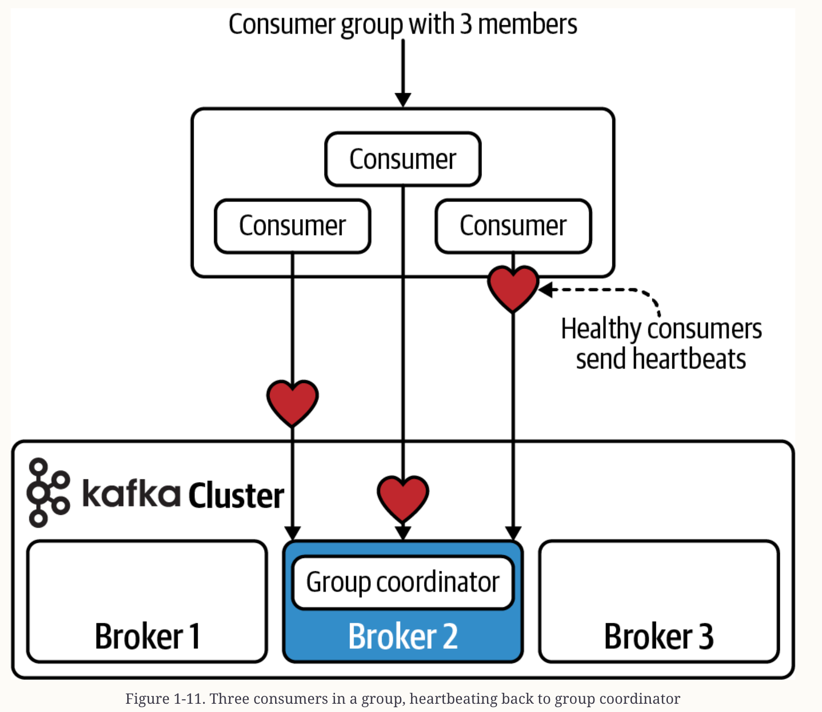
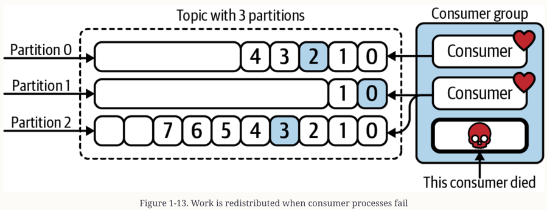

# About
This code corresponds with Chapter 1 in the upcoming O'Reilly book: [Mastering Kafka Streams and ksqlDB][book] by Mitch Seymour. This includes a simple demonstration of how to run a local Kafka cluster using Docker, create / describe Kafka topics, and produce / consume data from Kafka topics.

[book]: https://www.kafka-streams-book.com/

# Running Locally
The only dependency for running these examples is [Docker Compose][docker].

[docker]: https://docs.docker.com/compose/install/

Once Docker Compose is installed, you can start the local Kafka cluster using the following command:

```sh
$ docker-compose up
```

Now, log into the broker, since this is where we will be running our commands.
```sh
$ docker-compose exec kafka bash
```

## Create a topic
Once you're logged into the broker, run the following command to create a topic called `users`:

```sh
$ kafka-topics \
    --bootstrap-server localhost:9092 \
    --create \
    --topic users \
    --partitions 4 \
    --replication-factor 1
```

## Describe a topic
Once you've created the `users` topic, you can describe it using the following command:

```sh
$ kafka-topics \
    --bootstrap-server localhost:9092 \
    --describe \
    --topic users
```

You should see output similar to the following:
```sh
Topic: users	PartitionCount: 4	ReplicationFactor: 1	Configs:
	Topic: users	Partition: 0	Leader: 1	Replicas: 1	Isr: 1
	Topic: users	Partition: 1	Leader: 1	Replicas: 1	Isr: 1
	Topic: users	Partition: 2	Leader: 1	Replicas: 1	Isr: 1
	Topic: users	Partition: 3	Leader: 1	Replicas: 1	Isr: 1
``` 

## Produce data to a topic
The following command will allow you to produce data to the `users` topic that we created earlier. Run the following to be dropped into a prompt:

```sh
$ kafka-console-producer \
    --bootstrap-server localhost:9092 \
    --property key.separator=, \
    --property parse.key=true \
    --topic users
```

Once you are in the prompt, produce a few records. Keys and values are separated by `,`, and you'll need to hit `<Enter>` on your keyboard after each row.

```sh
1,mitch
2,elyse
3,isabelle
4,sammy
```

When you are finished, press `Control-C` on your keyboard to exit the prompt.

## Consuming data from a topic
Run the following command to consume the data we just produced to the `users` topic in the section above.

```sh
kafka-console-consumer \
    --bootstrap-server localhost:9092 \
    --topic users \
    --property print.headers=true \
    --property print.timestamp=true \
    --property print.key=true \
    --property print.value=true \
    --from-beginning
```
You should see the following output:
```sh
mitch
isabelle
sammy
elyse
```

## Cleanup
Once you are done, log out of the broker by typing `exit` and run the following command to tear down the local Kafka cluster:

```sh
docker-compose down
```

# Doc note 

## How Are Streams Stored?
Stored as commit log (.log):
- append-only
- ordered sequence: by offsets --> data can be processed by multiple processes

## Topics and Partitions


Kafka topics are broken into smaller units called partitions. (to achieve some level of parallelism)
- Partitions are individual logs
- Partition having its own set of offsets
- Global ordering is not supported at the topic level --> often send related records to the same partition.



Therefore, if you want to spread the processing load across N consumers in a single consumer group, you need N partitions
- consumer < partition --> each consumer can process multiple partitions
- consumer > partition --> some consumers will be chill

--> Topic is a named stream, composed of multiple partitions. And each partition is modeled as a commit log that stores data in ordered and append-only sequence.

## Events
- Data is stored in a Kafka topic’s partitions
- An event is a timestamped key-value pair that records something that happened

1. Headers: metadata
2. Keys: to identify related records.
3. Timestamp
4. Value: actual message contents, encoded as a byte array

## Kafka Cluster and Brokers
How data is physically stored in Kafka cluster.

(Vì ông Kafka này như 1 backbone --> Cần chịu lỗi tốt --> Act như 1 cluster gọi là brokers: tham gia vào việc truy xuất và lưu trữ dữ liệu)



Whenever a partition is replicated across multiple brokers:
- one broker will be designated as the `leader`: will process all read/write requests from producers/consumers for the given partition.
- other brokers that contain the replicated partitions are called `followers`: simply copy the data from the leader. 

If the leader fails, then one of the followers will be promoted as the new leader.

## Consumer Groups
Every `consumer group` is assigned to a special broker called the `group coordinator/group leader`:
- responsible for receiving heartbeats from the consumers
- triggering a rebalance of work (whenever a consumer is marked as dead)


