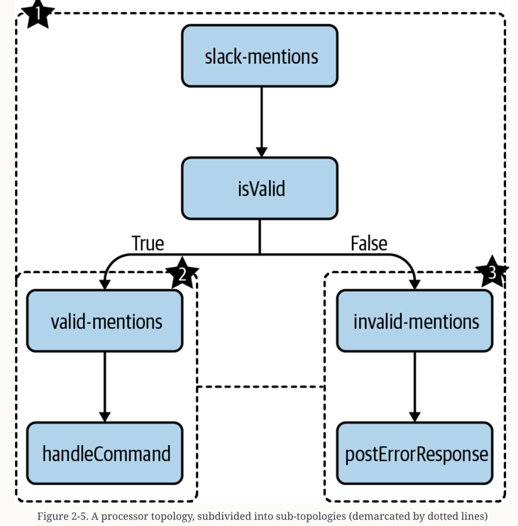

# About
This code corresponds with Chapter 2 in the upcoming O'Reilly book: [Mastering Kafka Streams and ksqlDB][book] by Mitch Seymour. This includes two "Hello, world" style applications: one implemented using the high-level DSL, and the other implemented using the Processor API.

Will print a simple greeting whenever they receive a message from the users topic in Kafka (e.g., upon receiving the message Mitch, each application will print Hello, Mitch).

[book]: https://www.kafka-streams-book.com/

# Running Locally
The only dependency for running these examples is [Docker Compose][docker].

[docker]: https://docs.docker.com/compose/install/

Once Docker Compose is installed, you can start the local Kafka cluster using the following command:

```sh
$ cd mastering-kafka-streams-and-ksqldb/chapter-02/hello-streams
$ docker-compose up
```

Now, follow either the **DSL example** or **Processor API example** instructions below, depending on which version of the demo you want to run.

The source code for this book already contains the initialized project structure for each tutorial, so it’s not necessary to run gradle init unless you are starting a new project for yourself
```sh
$ mkdir my-project && cd my-project

$ gradle init \
 --type java-application \
 --dsl groovy \
 --test-framework junit-jupiter \
 --project-name my-project \
 --package com.example
```


## DSL example

You can run the high-level DSL example with the following command:
```sh
$ ./gradlew runDSL --info
```

Once the dependencies are downloaded and the application is running (this may take a few minutes the first time you run the app, but will be much faster during subsequent runs), following the instructions under the __Producing Test Data__ section at the bottom of this README.

## Processor API example

You can run the low-level Processor API example with the following command:
```sh
$ ./gradlew runProcessorAPI --info
```

Once the dependencies are downloaded and the application is running (this may take a few minutes the first time you run the app, but will be much faster during subsequent runs), following the instructions under the __Producing Test Data__ section below.

# Producing Test Data
Once the Kafka Streams application is running (either the DSL or Processor API version), open a new shell tab and produce some data to the source topic (`users`).

```sh
$ docker-compose exec kafka bash

$ kafka-console-producer \
    --bootstrap-server localhost:9092 \
    --topic users
```

This will drop you in a prompt:

```sh
>
```

Now, type a few words, followed by `<ENTER>`.

```sh
>world
>izzy
```

You will see the following output if running the DSL example:
```sh
(DSL) Hello, world
(DSL) Hello, izzy
```

or slightly different output if running the Processor API example:
```sh
(Processor API) Hello, world
(Processor API) Hello, izzy
```
# Chapter 2. Getting Started with Kafka Streams 
Kafka Streams is a lightweight, yet powerful Java library for processing real-time streams of data.
## The Kafka Ecosystem
The heart of Apache Kafka:
- the distributed, append-only log
- the core Kafka code base, includes some important APIs for interacting with this log


Need to stream processing to data as it becomes available in Kafka

### Before Kafka Streams
Have a lack of library support for processing data in Kafka topics.

During these early days of the Kafka ecosystem, there were two main options for building Kafka-based stream processing applications:
1. Use the Consumer and Producer APIs directly:
   
    Read from and write to the event stream directly using Python, Java, Go, C/C++, Node.js, etc. Hard when AGG

2. Use another stream processing framework (e.g., Apache Spark Streaming, Apache Flink): 

    Introduces a lot of unneeded complexity

### Enter Kafka Streams (2016)
Unlike the Producer, Consumer, and Connect APIs, Kafka Streams is dedicated to helping you process real-time data streams.

Figure 2-1 depicts the previously discussed APIs in the Kafka ecosystem, with Kafka Streams operating at the stream processing layer.


Kafka Streams operates at an exciting layer of the Kafka ecosystem: the place where data from many sources converges.
It’s the same place where, in a pre–Kafka Streams world, we would have  written our own stream processing abstractions (using the Consumer/Producer API approach) or used another framework.

## Features at a Glance
Pros:
- A `high-level DSL` (Domain Specific Language)
- A `low-level Processor API` --> gives developers `fine-grained control`
- The ability to `join` streams and tables
- Operators and utilities for building both stateless and stateful stream processing applications.
- Support for `time-based operations`
- Kafka Streams just a `library`

## Operational Characteristics
Cần đánh giá kỹ nó xem nó có ổn định và lâu dài trước khi mình tìm hiểu quá sâu về nó ? :)

- Scalability
- Reliability
- Maintainability

--> OK 
## Comparison to Other Systems
See if there are other fish in the sea ? :) 

We’ll start by comparing Kafka Streams’ deployment model with other popular systems.

### Deployment Model 
- Apache Flink and Apache Spark Streaming: Cần setup 1 cụm xử lý riêng
- Kafka Streams: Được triển khai dưới dạng thư viện Java --> Đơn giản là add Kafka Streams dependency vào Java application

### Processing Model
- Apache Spark Streaming or Trident: `micro-batching`
- Kafka Streams: implements `event-at-a-time` processing, so events are processed immediately, one at a time, as they come in.

*NOTE*

Frameworks that use `micro-batching` are often optimized for greater throughput at the cost of higher latency. 
In Kafka Streams, you can achieve extremely low latency while also maintaining high throughput *by splitting data across many partitions.*

### Kafka Streams’ data processing architecture: `Kappa Architecture`

- Kafka Streams focuses solely on `streaming` use cases (this is called a `Kappa architecture`)
- Apache Flink and Apache Spark support both `batch` and `stream` processing (this is called a `Lambda architecture`).
  - Drawbacks: The operational burden of running and debugging two systems is going to be very high. And any new abstraction can only provide the features supported by the intersection of the two systems. 

One way to state the differences between the two systems is as follows:

- Kafka Streams is a stream-relational processing platform.

- Apache Beam is a stream-only processing platform.

A stream-relational processing platform has the following capabilities which are typically missing in a stream-only processing platform:

- Relations (or tables) are first-class citizens, i.e., each has an independent identity.

- Relations can be transformed into other relations.

- Relations can be queried in an ad-hoc manner

---> OK, chốt lại là:
1. Nếu hệ thống ko cần `hybrid` giữa streamming và batching --> dùng Kafka Streams
2. Có ông Apache Beam cũng ok, nhưng chưa có khả năng query state of a stream

## Use Cases
Kafka Streams is optimized for processing unbounded datasets quickly and efficiently, and is therefore a great solution for problems in low-latency, time-critical domains. 

## Processor Topologies
A collection of processors forms a `processor topology`, which is often referred to as simply the `topology`

Kafka Streams tận dụng một mô hình lập trình được gọi là `dataflow programming (DFP)`.

The stream processing logic in a Kafka Streams application is structured as a directed acyclic graph (DAG)


- Source processors: Sources are where information flows into the Kafka Streams application. Data is read from a Kafka topic and sent to one or more stream processors.
- Stream processors: Applying data processing/transformation logic. In the high-level DSL (`filter`, `map`, `flatMap`, and `join`)
- Sink processors: Write back to Kafka, or to be handled by another stream processing, or to be sent to a downstream data store via something like Kafka Connect. Like source processors, sink processors are connected to a Kafka topic.


### Sub-Topologies
In 2-4, howerver, if our application needs to consume from multiple source topics, then Kafka Streams will divide our topology into smaller sub-topologies to parallelize the work even further. 


Notice that both the `valid-mentions` and `invalid-mentions` topics serve as a `sink processor` in the first sub-topology, but as a `source processor` in the second and third sub-topologies.

### Depth-First Processing
How data actually flows through the interconnected processors in a Kafka Streams application >

Kafka Streams uses a `depth-first strategy` when processing data. When a new record is received, it is routed through each stream processor in the topology before another record is processed.

-> makes the dataflow much easier to understand, but slow stream processing operations can block other records.

Figure 2-7. Multiple records will never go through the topology at the same time


*NOTE*

When multiple sub-topologies are in play, the single-event rule does not apply to the entire topology, but to each sub-topology.

### Tasks and Stream Threads
When we define a topology in Kafka Streams, we are not actually executing the program. Instead, we are building a template for how data should flow through our application.

__A task is the smallest unit of work that can be performed in parallel in a Kafka Streams application…__

We can calculate the `number of tasks` that can be created for a given Kafka Streams sub-topology with the following math:

```
max(source_topic_1_partitions, ... source_topic_n_partitions)
```

For example, if your topology reads from one source topic that contains `16 partitions`, then Kafka Streams will create `16 tasks,` 
each of which will instantiate its own copy of the underlying processor topology. 
Once Kafka Streams has created all of the tasks, it will assign the source partitions to be read from to each task.

--> `Tasks` are just logical units that are used to instantiate and run a processor topology.

--> `Threads` are what actually execute the task

Không như Tasks, Thread ko có công thức nào để tính ra số lượng mà application nên chạy --> chỉ định bằng cách dùng: `num.stream.threads`

Ví dụ: Đọc từ topic gồm 4 partitions

`num.stream.threads = 2`


`num.stream.threads = 4`


## High-Level DSL Vs Low-Level Processor API
__Different solutions present themselves at different layers of abstraction.__

--> The more you abstract the details away, the more the software feels like “magic”

Kafka Streams allows developers to choose the abstraction level:
- DSL: using a functional style of programming
- Processor API: lower-level access to your data (e.g., access to record metadata), more granular access, more fine-grained

## Lab

## Streams and Tables 

```
KStream<Void, String> stream = builder.stream("users");
```
There are two ways to model the data in your Kafka topics: as a `stream` (also called a record stream) or a `table` (also known as a changelog stream).


We need to consider whether or not we want to track only the latest state/representation of a given key, or the entire history of messages:

**_Streams_**: These can be thought of as inserts in database


**_Table_**: Tables can be thought of as updates to a database. 

Tables, by nature, are _stateful_


Instead of tracking the latest record for each key, we could have just as easily calculated a rolling `count`.

Records that are written to Kafka are immutable (Chapter 1), so how is it possible to model data as updates, using a table representation of a Kafka topic?

-->  The table is materialized (được cụ thể hoá) on the Kafka Streams side using a `key-value` store which, by default, is implemented using `RocksDB`.
By consuming an ordered stream of events and keeping only the latest record for each key in the `client-side key-value` store (more commonly called a `state` store in Kafka Streams terminology).

--> The `table` isn’t something we consume from Kafka, but **something build on the client side**.

```java 
import java.util.Map.Entry;

var stream = List.of(
    Map.entry("a", 1),
    Map.entry("b", 1),
    Map.entry("a", 2));

var table = new HashMap<>();

stream.forEach((record) -> table.put(record.getKey(), record.getValue()));

stream ==> [a=1, b=1, a=2]

table ==> {a=2, b=1}
```

### Stream/Table Duality
The `duality` of tables and streams comes from the fact that **tables can be represented as streams, and streams can be used to reconstruct tables**

By changing our view of the table to a stream, we can simply process the update as an insert, and append the new record to the end of the log instead of updating the key.

```
var stream = table.entrySet().stream().collect(Collectors.toList());

stream.add(Map.entry("a", 3));

# The contents of the stream, no longer using update semantics, but instead insert semantics:
stream ==> [a=2, b=1, a=3] 
```

### KStream, KTable, GlobalKTable

**`KStream`**

A `KStream` is an abstraction of a partitioned `record` stream, in which data is represented using **insert** semantics 
(i.e., each event is considered to be `independent` of other events).

**`KTable`**

A `KTable` is an abstraction of a partitioned table (i.e., `changelog` stream), in which data is represented using **update** 
semantics (the latest representation of a given key is tracked by the application). Since `KTables` are partitioned, 
each Kafka Streams task contains only a subset of the full table.

**`GlobalKTable`**

This is similar to a `KTable`, except each `GlobalKTable` contains a complete (i.e., unpartitioned) copy of the
underlying data. We’ll learn when to use `KTables` and when to use `GlobalKTables` in Chapter 4.

# Summary

- Kafka Streams lives in the stream processing layer of the Kafka ecosystem. This is where sophisticated data processing, transformation, and enrichment happen.

- Kafka Streams was built to simplify the development of stream processing applications with a simple, DSL functional API and a set of stream processing primitives that can be reused across projects. When more control is needed, a lower-level Processor API can also be used to define your topology.

- Kafka Streams has a friendlier learning curve and a simpler deployment model than cluster-based solutions like Apache Flink and Apache Spark Streaming. It also supports event-at-a-time processing, which is considered true streaming.

- Kafka Streams is great for solving problems that require or benefit from real-time decision making and data processing. Furthermore, it is reliable, maintainable, scalable, and elastic.