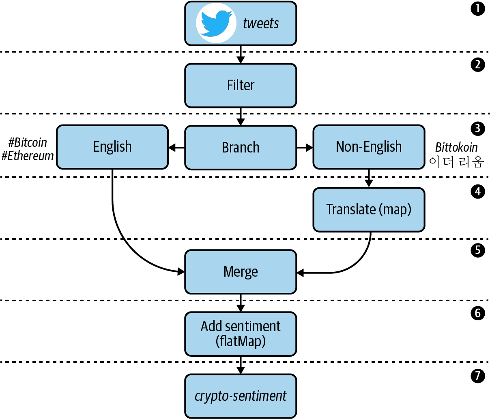

# About
This code corresponds with Chapter 3 in the upcoming O'Reilly book: [Mastering Kafka Streams and ksqlDB][book] by Mitch Seymour. This tutorial covers **Stateless processing** in Kafka Streams. Here, we demonstrate many stateless operators in Kafka Streams' high-level DSL by building an application that transforms and enriches tweets about various cryptocurrencies.

[book]: https://www.kafka-streams-book.com/

# Running Locally
The only dependency for running these examples is [Docker Compose][docker].

[docker]: https://docs.docker.com/compose/install/

Once Docker Compose is installed, you can start the local Kafka cluster using the following command:

```sh
$ cd mastering-kafka-streams-and-ksqldb/chapter-03/crypto-sentiment
$ docker-compose up
```

Regarding the Kafka Streams application, there are two easy options for running the example code, depending on whether or not you want to use a dummy client for performing tweet translation and sentiment analysis, or if you actually want to use Google's Natural Language API (which requires a service account) to perform these tasks. If you don't want to bother setting up a service account, no worries. Just follow the steps under **Option 1**.

## Option 1 (dummy translation / sentiment analysis)
First, if you want to see this running without setting up a service account for the translation and sentiment analysis service, you can run the following command:

```sh
$ ./gradlew run --info
```

Now, follow the instructions in [Producing Test Data](#-producing-test-data).

## Option 2 (actual translation / sentiment analysis)
If you want the app to actually perform tweet translation and sentiment analysis, you will need to setup a service account with Google Cloud.

You can download `gcloud` by following the instructions [here](https://cloud.google.com/sdk/docs/downloads-interactive#mac). Then, run the following commands to enable the translation / NLP (natural language processing) APIs, and to download your service account key.

```bash
# login to your GCP account
$ gcloud auth login <email>

# if you need to create a project
$ gcloud projects create <project-name> # e.g. kafka-streams-demo. must be globally unique so adjust accordingly

# set the project to the appropriate value
# see `gcloud projects list` for a list of valid projects
$ gcloud config set project <project>

# create a service account for making NLP API requests
$ gcloud beta iam service-accounts create <sa-name> \ # e.g. <sa-name> could be "dev-streams"
    --display-name "Kafka Streams"

# enable the NLP API
$ gcloud services enable language.googleapis.com

# enable the translate API
$ gcloud services enable translate.googleapis.com

# create and download a key
$ gcloud iam service-accounts keys create ~/gcp-demo-key.json \
     --iam-account <sa-name>@<project>.iam.gserviceaccount.com
```

Then, set the following environment variable to the location where you saved your key.
```
export GCP_CREDS_PATH=~/gcp-demo-key.json
```

Finally, run the Kafka Streams application using the following command:
```sh
$ ./gradlew run --info
```

Now, follow the instructions in [Producing Test Data](#-producing-test-data).

# Producing Test Data
We have a couple of test records saved to the `data/test.json` file, which is mounted in the `kafka` container for convenience. Feel free to modify the data in this file as you see fit. Then, run the following command to produce the test data to the source topic (`tweets`).

```sh
$ docker-compose exec kafka bash

$ kafka-console-producer \
  --bootstrap-server kafka:9092 \
  --topic tweets < test.json
```

Then, in another tab, run the following command to consume data from the sink topic (`crypto-sentiment`).
```sh
$ docker-compose exec schema-registry bash

$ kafka-avro-console-consumer \
 --bootstrap-server kafka:9092 \
 --topic crypto-sentiment \
 --from-beginning
 ```
 
 You should see records similar to the following appear in the sink topic.
 ```json
 {"created_at":1577933872630,"entity":"bitcoin","text":"Bitcoin has a lot of promise. I'm not too sure about #ethereum","sentiment_score":0.3444212495322003,"sentiment_magnitude":0.9464683988787772,"salience":0.9316858469669134}
{"created_at":1577933872630,"entity":"ethereum","text":"Bitcoin has a lot of promise. I'm not too sure about #ethereum","sentiment_score":0.1301464314096875,"sentiment_magnitude":0.8274198304784903,"salience":0.9112319163372604}
```

# Chapter 3. Stateless Processing

## Stateless Vs Stateful Processing

- In `stateless` applications, each event handled by your Kafka Streams application is processed independently of other events, and only stream views are needed by your application.
In other words, your application treats each event as a self-contained insert and requires no memory of previously seen events
- In `stateful` applications, need to remember information about previously seen events in one or more steps of your processor topology, usually for the purpose of aggregating, windowing, or joining event streams.
need to track additional data, or `state`.

In the high-level DSL, the type of stream processing application you ultimately build boils down to the individual operators that are used in your topology
(Giống ông Spark cũng chia là 2: transform và action)

## Introducing Our Tutorial: Processing a Twitter Stream

In this tutorial, we will explore the use case of algorithmic trading. Sometimes called high-frequency trading (HFT), involves building software to evaluate and purchase securities automatically.
we will build a stream processing application that will help us gauge market sentiment around different types of cryptocurrencies, and use these sentiment scores as investment/divestment signals in a custom trading algorithm.

1. Tweets that mention certain digital currencies (#bitcoin, #ethereum) should be consumed from a source topic called `tweets`:

    1.1. Since each record is JSON-encoded, we need to figure out how to properly `deserialize` these records into higher-level data classes.

    1.2. Unneeded fields should be removed during the deserialization process to simplify our code. Selecting only a subset of fields to work with is referred to as `projection`, and is one of the most common tasks in stream processing.

2. Retweets should be excluded from processing. This will involve some form of data `filtering`.

3. Tweets that aren’t written in English should be `branched` into a separate stream for translating.

4. Non-English tweets need to be translated to English. This involves `mapping` one input value (the non-English tweet) to a new output value (an English-translated tweet).

5. The newly translated tweets should be `merged` with the English tweets stream to create one unified stream.

6. Each tweet should be enriched with a sentiment score, which indicates whether Twitter users are conveying positive or negative emotion when discussing certain digital currencies. Since a single tweet could mention multiple cryptocurrencies, we will demonstrate how to convert each input (tweet) into a variable number of outputs using a `flatMap` operator.

7. The enriched tweets should be serialized using Avro, and written to an output topic called `crypto-sentiment`. Our fictional trading algorithm will read from this topic and make investment decisions based on the signals it sees.


Figure 3-1. The topology that we will be implementing for our tweet enrichment application



## Adding a KStream Source Processor
`Tweets` source topic
```json
{
    "CreatedAt": 1602545767000,
    "Id": 1206079394583924736,
    "Text": "Anyone else buying the Bitcoin dip?",
    "Source": "",
    "User": {
        "Id": "123",
        "Name": "Mitch",
        "Description": "",
        "ScreenName": "timeflown",
        "URL": "https://twitter.com/timeflown",
        "FollowersCount": "1128",
        "FriendsCount": "1128"
    }
}
```

```java
  public static Topology buildV1() {
    StreamsBuilder builder = new StreamsBuilder();
    /**
     * keys and values coming out of the tweets topic are being encoded as byte arrays.
     * But the tweet records are actually encoded as JSON objects by the source connector: https://www.confluent.io/hub/jcustenborder/kafka-connect-twitter
     * Means that Kafka clients, including Kafka Streams applications, are responsible for serializing and deserializing these byte streams in order to work with higher-level objects and formats.
     */
    KStream<byte[], byte[]> stream = builder.stream("tweets");
    stream.print(Printed.<byte[], byte[]>toSysOut().withLabel("tweets-stream")); // view data as it flows

    return builder.build();
  }
```

```java
class App {
  public static void main(String[] args) {
    Topology topology = CryptoTopology.buildV1();

    // set the required properties for running Kafka Streams
    Properties config = new Properties();
    config.put(StreamsConfig.APPLICATION_ID_CONFIG, "dev");
    config.put(StreamsConfig.BOOTSTRAP_SERVERS_CONFIG, "localhost:29092");

    // build the topology and start streaming!
    KafkaStreams streams = new KafkaStreams(topology, config);

    //stop the Kafka Streams application when a global shutdown signal is received.
    Runtime.getRuntime().addShutdownHook(new Thread(streams::close));

    System.out.println("Starting Twitter streams");

    // the topology is executed via background processing threads --> that why a shutdown hook is required.
    streams.start();
  }
}
```

--> Run:
```shell
# Tab 1 
$ ./gradlew run --info
```
```shell
# Tab 2
[appuser@kafka data]$ ls
test.json
[appuser@kafka data]$ cat test.json 
{"CreatedAt":1577933872630,"Id":10005,"Text":"Bitcoin has a lot of promise. I'm not too sure about #ethereum","Lang":"en","Retweet":false,"Source":"","User":{"Id":"14377870","Name":"MagicalPipelines","Description":"Learn something magical today.","ScreenName":"MagicalPipelines","URL":"http://www.magicalpipelines.com","FollowersCount":"248247","FriendsCount":"16417"}}
{"CreatedAt":1577933871912,"Id":10006,"Text":"RT Bitcoin has a lot of promise. I'm not too sure about #ethereum","Lang":"en","Retweet":true,"Source":"","User":{"Id":"14377871","Name":"MagicalPipelines","Description":"","ScreenName":"Mitch","URL":"http://blog.mitchseymour.com/","FollowersCount":"120","FriendsCount":"120"}}
[appuser@kafka data]$ kafka-console-producer \
>   --bootstrap-server kafka:9092 \
>   --topic tweets < test.json
```

Output:
```shell
# Tab 1: See the raw byte arrays --> Need serialization and deserialization
[tweets-stream]: null, [B@49f0cd7a
[tweets-stream]: null, [B@79526793
```

## Serialization/Deserialization
Kafka is a bytes-in, bytes-out stream processing platform --> clients, like Kafka Streams, are responsible for converting the byte streams into higher-level objects

Figure 3-2. An architectural view of where the deserialization and serialization processes occur in a Kafka Streams application


In Kafka Streams, serializer and deserializer classes are often combined into a single class called a `Serdes` (`Serdes.Integer(),...`)

Kafka Streams doesn’t ship with `Serdes` classes for some common formats, including JSON, Avro, and Protobuf.

### Building a Custom Serdes

Write code for deserializing tweets as higher-level JSON objects. We could just use the built-in String Serdes, 
`Serdes.String()`, instead of implementing our own, but that would make working with the Twitter data difficult, since we couldn’t easily access each field in the tweet object.
--> Use Java libraries for serializing and deserializing JSON (`Gson`)

```java 
Gson gson = new Gson();
byte[] bytes = ...;
Type type = ...;
gson.fromJson(new String(bytes), type);

// Inverse of above process
Gson gson = new Gson();
gson.toJson(instance).getBytes(StandardCharsets.UTF_8);
```

### Defining Data Classes
The first step is to define a data class, which is what the raw byte arrays will be deserialized into.

--> To convert JSON byte arrays into Java objects

```java 
public class Tweet {
  private Long createdAt;
  private Long id;
  private String lang;
  private Boolean retweet;
  private String text;

  // getters and setters omitted for brevity
}
```

### Implementing a Custom Deserializer
Simply need to implement the `Deserializer` interface in the Kafka client library

```java
import org.apache.kafka.common.serialization.Deserializer;

public class TweetDeserializer implements Deserializer<Tweet> {

   // Twitter Kafka connector uses upper camel case for field names (VD: ThisIsAnExample)
   private Gson gson =
           new GsonBuilder().setFieldNamingPolicy(FieldNamingPolicy.UPPER_CAMEL_CASE).create();

   // Override the deserialize method with our own logic for deserializing records in the tweets topic
   @Override
   public Tweet deserialize(String topic, byte[] bytes) {
      if (bytes == null) return null;

      // Use the Gson library to deserialize the byte array into a Tweet object
      return gson.fromJson(new String(bytes, StandardCharsets.UTF_8), Tweet.class);
   }
}
```

### Implementing a Custom Serializer
Same as above

```java 
class TweetSerializer implements Serializer<Tweet> {
  private Gson gson = new Gson();

  @Override
  public byte[] serialize(String topic, Tweet tweet) {
    if (tweet == null) return null; 1
    return gson.toJson(tweet).getBytes(StandardCharsets.UTF_8); 2
  }
}
```

### Building the Tweet Serdes
Combine these two above classes into a `chapter-03/crypto-sentiment/src/main/java/com/magicalpipelines/serialization/json/TweetSerdes.java`.

```java 
    // start streaming tweets using our custom value serdes. Note: regarding
    // the key serdes (Serdes.ByteArray()), if could also use Serdes.Void()
    // if we always expect our keys to be null
    KStream<byte[], Tweet> stream =
        builder.stream("tweets", Consumed.with(Serdes.ByteArray(), new TweetSerdes()));
    stream.print(Printed.<byte[], Tweet>toSysOut().withLabel("tweets-stream"));
```

--> Khi run: Created a KStream that leverages our Tweet data class
```shell
[tweets-stream]: null, com.magicalpipelines.serialization.Tweet@5d1ee0bb
[tweets-english]: null, com.magicalpipelines.serialization.Tweet@5d1ee0bb
[tweets-stream]: null, com.magicalpipelines.serialization.Tweet@68edc949
```

Note: 

Kafka Streams has a special config, `DEFAULT_DESERIALIZATION_EXCEPTION_HANDLER_CLASS_CONFIG`, that can be used to specify a deserialization exception handler.
You can implement your own exception handler, or use one of the built-in defaults, including `LogAndFailExceptionHandler` (which logs an error and then sends a shutdown signal to Kafka Streams) 
or `LogAndContinueExceptionHandler` (which logs an error and continues processing).

## Filtering Data


- filter: requires to pass in a Boolean expression, called a `Predicate`

- filterNot

```java 
    // filter out retweets
    KStream<byte[], Tweet> filtered =
        stream.filterNot(
            (key, tweet) -> {
              return tweet.isRetweet();
            });
```

## Branching Data

```java
    // match all tweets that specify English as the source language
    Predicate<byte[], Tweet> englishTweets = (key, tweet) -> tweet.getLang().equals("en");

    // match all other tweets
    Predicate<byte[], Tweet> nonEnglishTweets = (key, tweet) -> !tweet.getLang().equals("en");
```

```java
    // branch based on tweet language
    KStream<byte[], Tweet>[] branches = filtered.branch(englishTweets, nonEnglishTweets);

    // English tweets
    KStream<byte[], Tweet> englishStream = branches[0];
    englishStream.print(Printed.<byte[], Tweet>toSysOut().withLabel("tweets-english"));

    // non-English tweets
    KStream<byte[], Tweet> nonEnglishStream = branches[1];
    nonEnglishStream.print(Printed.<byte[], Tweet>toSysOut().withLabel("tweets-non-english"));
```

Now that we have created two substreams (`englishStream` and `nonEnglishStream`), we can apply different processing logic to each

## Translating Tweets

Transforming one input record into exactly one new output record:
- `map`

- `mapValues`

`map` requires us to specify a new record `value` and record `key`, while `mapValues` requires us to just set a new `value`


```java 
KStream<byte[], Tweet> translatedStream =
  nonEnglishStream.map(
      (key, tweet) -> { 
        byte[] newKey = tweet.getUsername().getBytes();  // We can simple use mapvalue to skip this line
        Tweet translatedTweet = languageClient.translate(tweet, "en");
        return KeyValue.pair(newKey, translatedTweet); 
      });
```

## Merging Streams


```java
KStream<byte[], Tweet> merged = englishStream.merge(translatedStream);
```

## Enriching Tweets

Our current data class, `Tweet`, represents the structure of the raw tweets in our source topic (JSON). 
We need a new data class for representing the enriched records that we will be writing to our output topic (`crypto-sentiment`) --> `Avro`

### Avro Data Class
Due to its compact byte representation (which is advantageous for high throughput applications), native support for record schemas, and a schema management tool called Schema Registry (which works well with Kafka Streams).

Avro:
- _generic records_: when the record schema isn’t known at runtime --> access field names using generic getters and setters (`GenericRecord.get(String key)` and `GenericRecord.put(String key, Object value)`)
- _specific records_: are Java classes that are generated from Avro schema files -->  VD: have class named `EntitySentiment` --> `entitySentiment.getSentimentScore()`

1. Since our application defines the format of its output records --> we use _specific records_

   A good place to add a schema definition for Avro data is in the `src/main/avro` + `entity_sentiment.avsc`

2. Generate a data class from this definition

   Add some dependencies to our project. `build.gradle` file:

   ```
   plugins {
     id 'com.commercehub.gradle.plugin.avro' version '0.9.1' -- Gradle plug-in is used to autogenerate Java classes from Avro schema
   }
   
   dependencies {
     implementation 'org.apache.avro:avro:1.8.2'  -- contains the core classes for working with Avro
   }
   ```
   
```shell
 ./gradlew build --info   
```

This generated data class `com.magicalpipelines.model.EntitySentiment` contains a new set of fields for storing tweet sentiment (`sentiment_score`, `sentiment_magnitude`, and `salience`) and corresponding getter/setter methods.
   
### Sentiment Analysis

In some cases, we may want to produce zero, one, or even multiple output records for a single input record. For example:
```shell
{"entity": "bitcoin", "sentiment_score": 0.80}
{"entity": "ethereum", "sentiment_score": -0.20}
```

Need to convert a single input record into a variable number of output records:
- `flatMap`
- `flatMapValues`

